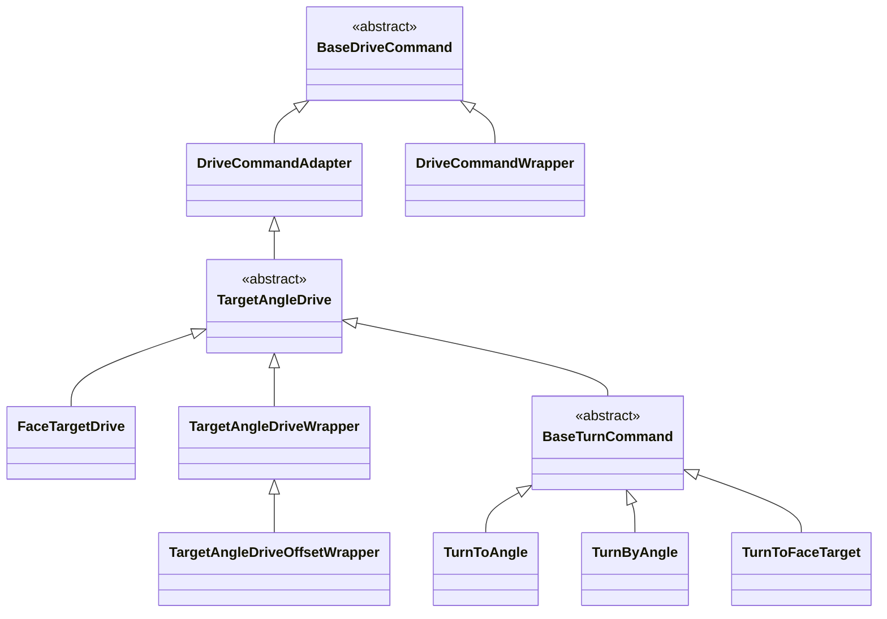

# Generic Swerve Drive Commands
This java package contains swerve drive commands that are compatible with any swerve code base.

## Getting Started
There are a lot of drive classes here, so let me show you where to start:

```java
// Create your subsystem and joystick like normal
MyDriveSubsystem drive = new MyDriveSubsystem();

XboxController controller = new XboxController(0);

// Now create your swerve drive command config
// This is used by the drive commands to get information about your robot's current state, and provide desired chassis speed outputs based on that state. Currently, this state information includes your estimated robot pose, current module states, and gyro rate in radians per second
DriveCommandConfig driveConfig = new DriveCommandConfig(
    drive.getKinematics(),
    drive::getPose,
    drive::getModuleStates,
    drive::getGyroRate,
    drive::setDesiredSpeeds,
    drive // Subsystem requirements
);

// Create the drive command with your config
BaseDriveCommand driveCommand = BaseDriveCommand.builder(driveConfig)
    .usePercentSpeeds(true)
    .withSpeedSuppliers(
        () -> -controller.getLeftY(),
        () -> -controller.getLeftX(),
        () -> -controller.getRightX())
    .build();

drive.setDefaultCommand(driveCommand);
```

The above snippet of code will create a robot relative drive command that moves using Xbox controller inputs. Notice we're also calling the builder's `usePercentSpeeds()` method. This method tells the builder that we want our command's inputs to represent percentages of the maximum speed constraints. If we set this to `false` (also the default), our inputs will be represented as raw speeds in meters per second.

### Providing Max Speed Constraints
By default, the DriveCommandBuilder object supplies pretty conservative max speed constraints. If you wish to override these, you can do that using the `withSpeedConstraints()` method, like below:
```java
final double kMaxSpeedMetersPerSecond = Units.feetToMeters(3);
final double kMaxSpeedRadiansPerSecond = Units.degreesToRadians(180);

BaseDriveCommand driveCommand = BaseDriveCommand.builder(driveConfig)
    .withSpeedConstraints(kMaxSpeedMetersPerSecond, kMaxSpeedRadiansPerSecond);
    .usePercentSpeeds(true)
    .withSpeedSuppliers(
        () -> -controller.getLeftY(),
        () -> -controller.getLeftX(),
        () -> -controller.getRightX())
    .build();
```

### Field Relative Controls
To use field relative controls, simply use the builder's `useFieldRelative()` method, passing `true` for field relatie mode, and `false` for robot relative mode. You can also provide a `Supplier<Boolean>` to the method if you wish to bind it to a button.

```java
BaseDriveCommand driveCommand = BaseDriveCommand.builder(driveConfig)
    .usePercentSpeeds(true)
    .useFieldRelative(controller::getRightBumper)
    .withSpeedSuppliers(
        () -> -controller.getLeftY(),
        () -> -controller.getLeftX(),
        () -> -controller.getRightX())
    .build();
```

## Advanced Examples
### Facing Targets
So far, we have seen some pretty simple examples. They will provide you a good start to driving around your swerve drive base. Now, how do we do more complex things like facing a target while we drive?

It is actually quite simple! Just provide the Translation2d, Pose2d, or Pose3d to the builder's `facesTarget()` method, along with a PIDController that is **correctly tuned to *your* robot**. 
> **NOTE**: This drive command assumes your robot's pose estimation is accurate!
```java
PIDController turnController = new PIDController(kP, kI, kD);
Pose2d hubPose = new Pose2d(8.23, 4.115, Rotation2d.fromDegrees(24));

BaseDriveCommand driveCommand = BaseDriveCommand.builder(driveConfig)
    .facesTarget(hubPose, turnController)
    .useFieldRelative(true)
    .usePercentSpeeds(true)
    .withLinearSpeedSuppliers(
        () -> -controller.getLeftY(),
        () -> -controller.getLeftX())
    .build();
```

In the above example, the angular speed of the robot is completely handled by the drive command, and calculated based on the robot's position relative to the target. We provide inputs for linear (or translational) speeds using the builder's `withLinearSpeedSuppliers()` method.

### Drive Command Wrappers
The `DriveCommandWrapper` class can be used to [decorate](https://en.wikipedia.org/wiki/Decorator_pattern) any drive command.

The `TargetAngleDriveWrapper` class can be used to decorate any `TargetAngleDrive` commands. These classes are primarily used to create helper methods in the drive command classes, but can be extended by the user to do interesting things. These helper methods can be called directly on drive commands, without needing to use a builder, although using a builder is the recommended approach. Here are a few examples of these helper methods:

> In this example, the robot will always attempt to face 30 degrees away from the target
```java
BaseDriveCommand driveCommand = new FaceTargetDrive(driveConfig, controller, target).withAngleOffset(Rotation2d.fromDegrees(30));
```
> In this example, the robot will always attempt to face 180 degrees away from the target
```java
BaseDriveCommand driveCommand = new FaceTargetDrive(driveConfig, controller, target).withAngleOffset(Rotation2d.fromDegrees(180));

// The above can also be written as
BaseDriveCommand driveCommand = new FaceTargetDrive(driveConfig, controller, target).facingAway();
```


## Drive Command Class Diagram

